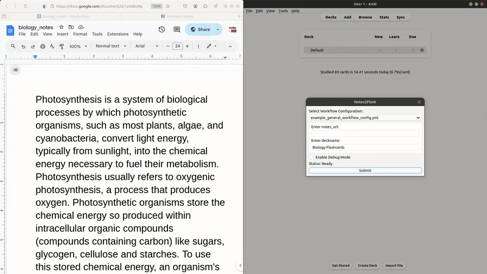

# notes2flash
AI-powered application to organize Google Doc notes and convert them into Anki flashcards.



## Features

- Compatibility with Google Docs, Notion, and Obsidian
- Minimum setup to scrape contents of online documents and convert them into Anki flashcards
- Ability to track document changes
- Highly customizable flashcard creation process via YAML workflow configuration
- Control over user inputs, choice of LLM (ChatGPT, Llama, Genmini, and more through OpenRouter.ai)
- Ability to prompt chain with multiple API calls

**Note**: The addon has been tested on the following versions of Anki:
- 24.06.03 (qt6)
- 23.12.1 (qt6)
- 2.1.49

## Installation

1. Download the addon files and place them in your Anki addons folder.
2. Install the required dependencies by running:
   ```
   pip install --target addon/libs -r requirements.txt
   ```


   Alternatively, you can use Docker by running:
   ```
   docker-compose up
   ```
  Once the process is complete, you can find the generated addon in the `output/notes2flash.ankiaddon` directory.
  Open Anki and navigate to `Tools -> Add-ons -> Install from file`.
  Select the `notes2flash.ankiaddon` file from the output directory to install the addon.


## Setting Up OpenRouter.ai Account

1. Create an OpenRouter.ai account quickly using your Gmail.
2. Go to the "Keys" section and press "Create Key."
3. Copy the generated key into the `config.json` of the notes2flash addon:
   - In Anki, navigate to Tools > Add-ons > Notes2Flash > Config.
   - Paste the key into the value within quotes by `"openrouter_api_key"`.
4. If you wish to use paid models, add credits to your account. The minimum top-up is $5 USD, which is recommended for optimal performance, especially for demanding workflows. For a great price/performance model, OpenAI's GPT-4o-mini is highly effective. For example, processing 1 page (500 words) and creating 25 flashcards (1 per sentence on average) would cost approximately $0.0024.

## Usage with Google Docs

1. **Public Document**: Make your Google Doc public and use the document ID or URL.
2. **Google Docs API**: For more control over document privacy, set up the Google Docs API:
   - Save your account details as `service_account.json` in the addon directory, typically located at `~/.local/share/Anki2/addons21`.

## Usage with Notion

1. **Create a Notion Integration**:
   - Visit the Notion Developer Portal and select "New Integration."
   - Provide a name, assign it to your workspace, and set the necessary permissions.
   - After creation, store the Integration Token securely for authentication.
2. **Share Notion Pages**:
   - Navigate to the page you want your integration to access.
   - Click the "Share" button, select "Invite," and search for your integration by name to grant it access.

## Usage with Obsidian

Compatibility with Obsidian is limited due to the lack of free native public access cloud storage. Scraping is done via the Obsius addon https://github.com/jonstodle/obsius-obsidian-plugin (shoutout to the developer!):
1. Publish your Obsidian note via the addon to produce a live public version (e.g., https://obsius.site/2v1e5g2j566s7071371k) that can be used as a URL.

## workflow example 1 - General simple example
here’s a simple example of a yaml workflow configuration:

```yaml
workflow_name: "barebone notes2flash workflow config example"

user_inputs: [notes_url]

# 1) **scrape notes from online docs (google docs, notion, obsius)**
scrape_notes:
  - url: "{notes_url}"
    output: scraped_notes_output  # the output name for the scraped notes

# 2) **process notes into flashcards**
process_notes_to_cards:
  - step: "organize notes and create flashcards"
    model: "meta-llama/llama-3.1-70b-instruct:free"
    chunk_size: 4000  # maximum chars per chunk (roughly 4 * token limit for english, 1*token_limit for mandarin)
    input:
      - scraped_notes_output  # input is the notes content from scrape_notes stage
    attach_format_reminder: true # if true will append a format reminder to the prompt ensuring api outputs correct format
    output: flashcards  # the output will always be a list of dictionaries with the following fields:
    output_fields:
      - question
      - answer
    prompt: |
      organize the following notes into flashcards:
      {scraped_notes_output} 

#  3)  **add cards to anki**
add_cards_to_anki:
  flashcards_data: flashcards  # input is the list of flashcards
  deck_name: "example_deckname"
  card_template:
    template_name: "notes2flash basic note type" # 'notes2flash basic note type' is a default note type included in addon found in ./included_note_types/
    front: "{question}"  # the front of the card will show the question
    back: "{answer}"  # the back of the card will show the answer
```

### Workflow Explanation

The workflow is divided into three main stages:

1. **Scrape Notes**: In this stage, the `scrape_notes` key is used to specify the source URL from which to scrape the content. The output for the scraped notes is user configurable and defined as `scraped_notes_output` here. This name can be referenced in later stages, allowing you to easily manage and utilize the scraped content in the processing steps.

2. **Process Notes into Flashcards**: This stage takes the output from the `scrape_notes` stage as input. You must specify the output name (`scraped_notes_output` in this case) in the `input` section to ensure the correct data is processed. The model specified will organize the scraped notes and generate flashcards. The output will be a list of dictionaries containing the fields defined in `output_fields`, such as `question` and `answer`. 

   Additionally, if `attach_format_reminder` is set to `True`, a structured reminder will be appended to the end of the prompt. This reminder ensures that the API outputs the data in the expected format for the third stage, which is a list of dictionaries where each dictionary represents a flashcard with the specified `output_fields`. 

   The reminder that would be generated for the above example workflow config would be like the following:

    ```
    **IMPORTANT**
    Format the output as a list of dictionaries, where each dictionary represents a flashcard.

    Each dictionary must contain exactly these keys: question, answer.

    Strictly adhere to this structure. Any deviation from this format will not be accepted.

    Example output:
    [
        {
            "question": "example_question_1",
            "answer": "example_answer_1"
        },
        {
            "question": "example_question_2",
            "answer": "example_answer_2"
        },
        ...
    ]
    ``` 

3. **Add Cards to Anki**: In the final stage, the generated flashcards are added to Anki. The `flashcards_data` key takes the output from the previous stage, and you must specify the output name (`flashcards`) to ensure the correct data is added. The card template defines how each flashcard will be structured in Anki.

Save your custom workflow configurations in the `addon/workflow_configs` directory with a `.yml` extension.


## workflow example 2 - More user inputs
The user_inputs key in the config allows you to customize variables that are specified by the user at time before runtime, for example if we add some alterations to the first workflow config by adding some variables to speicify the output anki deckname and also the topic of the notes to give the AI model some context which we can put in the prompt:

```yaml
workflow_name: "barebone notes2flash workflow config example"

user_inputs: [notes_url, notes_topic, deckname]

# 1) **scrape notes from online docs (google docs, notion, obsius)**
scrape_notes:
  - url: "{notes_url}"
    output: scraped_notes_output  # the output name for the scraped notes

# 2) **process notes into flashcards**
process_notes_to_cards:
  - step: "organize notes and create flashcards"
    model: "meta-llama/llama-3.1-70b-instruct:free"
    chunk_size: 4000  # maximum chars per chunk (roughly 4 * token limit for english, 1*token_limit for mandarin)
    input:
      - scraped_notes_output  # input is the notes content from scrape_notes stage
      - notes_topic # ***NEW INPUT, user input to be added to prompt to give AI context on notes contents
    attach_format_reminder: true # if true will append a format reminder to the prompt ensuring api outputs correct format
    output: flashcards  # the output will always be a list of dictionaries with the following fields:
    output_fields:
      - question
      - answer
    prompt: |
      organize the following notes of the topic {notes_topic} into flashcards:
      {scraped_notes_output} 

#  3)  **add cards to anki**
add_cards_to_anki:
  flashcards_data: flashcards  # input is the list of flashcards
  deck_name: "{deckname}" #***NEW INPUT, allowing the user to choose outputed deckname 
  card_template:
    template_name: "notes2flash basic note type" # 'notes2flash basic note type' is a default note type included in addon found in ./included_note_types/
    front: "{question}"  # the front of the card will show the question
    back: "{answer}"  # the back of the card will show the answer
```

## Workflow Example 3 - Prompt Chaining 
The second stage `process_notes_to_cards` also allows prompt chaining via addition steps. See below for an example workflow that uses two steps/prompts to extract Mandarin vocabulary and then generate example sentences.

```yaml
workflow_name: "Vocabulary Extraction and Multi-step Processing"

user_inputs: [notes_url, deckname]

# 1) **scrape notes from online docs (google docs, notion, obsius)**
scrape_notes:
  - url: "{notes_url}"
    output: scraped_notes_output  # the output name for the scraped notes

# 2) **Process Notes (Multiple Steps)**
process_notes_to_cards:
  - step: "Extract key sentences"
    model: "openai/gpt-4o-mini"
    chunk_size: 4000
    input:
      - scraped_notes_output
    attach_format_reminder: true # if true will append a format reminder to the prompt ensuring api outputs correct format
    output: extracted_keywords  # Intermediate output
    prompt: |
      Extract keywords from the following document. The document contains vocabulary words or short phrases in Mandarin. For each keyword, provide its pinyin and English translation. Remove any irrelevant information or duplicates. If there are multiple valid translations for a keyword, choose the most common one.

      Output in the following format:
      [
        {"keyword": "word1", "pinyin": "pinyin1", "translation": "translation1"},
        {"keyword": "word2", "pinyin": "pinyin2", "translation": "translation2"},
        ...
      ]

      Document:
      {scraped_notes_output}   
 
    
  - step: "Generate flashcards"
    model: "openai/gpt-4o-mini"
    chunk_size: 4000
    input:
      - extracted_keywords  # Input is the extracted keywords
    attach_format_reminder: false 
    output: flashcards  # Final output
    output_fields:
      - sentence
      - translation
      - keywords
    prompt: |
      prompt: |
      For each group of related keywords below, generate an example sentence in Mandarin that naturally uses one or more of the keywords in a contextually appropriate way. If the sentence requires additional Mandarin keywords for clarity, include them as well, provided they aren't commonly known by an upper-intermediate learner.

      Additionally, list the keywords in the format "keyword pinyin translation," using `<br>` as a separator if multiple keywords are included.

      **Important**: The output must be in JSON format where each dictionary has exactly these three keys: "sentence," "translation," and "keywords." Do not change these keys.

      Format the output exactly like this:
      [
        {"sentence": "Example sentence in Mandarin.", "translation": "English translation of the sentence.", "keywords": "keyword1 pinyin1 translation1<br>keyword2 pinyin2 translation2"},
        {"sentence": "Another example sentence in Mandarin.", "translation": "English translation of this sentence.", "keywords": "keywordA pinyinA translationA<br>keywordB pinyinB translationB"},
        ...
      ]

      Keywords:
      {extracted_keywords} 
   
#  3)  **Add Cards to Anki**
add_cards_to_anki:
  flashcards_data: flashcards  # Input is the list of flashcards
  deck_name: "{deckname}"
  card_template:
    template_name: "notes2flash basic note type" # 'notes2flash basic note type' is a default note type included in addon found in ./included_note_types/
    front: "{sentence}"
    back: "{translation}<br><br>{keywords}"
```
Only the final step needs to output the 'flashcards_data'-like format ie a list of dicts with keys for the output fields. The outputs corresponding to the intermediate processing steps will be passed into the later steps simply as a string. As such the intermediate steps dont need to specify the keys for `output_fields` or `attach_format_reminder`. Notice for the final step in this example I have `attach_format_reminder: false`, this is because my output field `keywords` has a more complex structure and so it is better to specify the exact structure I want myself.


## Debugging and Troubleshooting

- Enable debug mode in the addon interface for detailed logging.
- Check the `notes2flash.log` file in the addon directory for error messages and execution logs.
- Use the logs to identify issues in your workflow configuration or API calls.
- A common error is that the API is not formatting the output properly, it should be a list of dictionaries where each dictionary represents a flashcard with the fields specified in `output_fields`

## Tips for Creating Effective Workflows

- Ensure your prompts are explicit and clearly define the expected output format.
- Test your workflows with various types of notes to ensure they work as expected.
- Use descriptive names for your workflow files to easily identify their purpose.

## Error Handling

The addon provides detailed error messages and logging. If you encounter issues:

1. Check the error message in the Anki interface.
2. Review the `notes2flash.log` file for more information.
3. Ensure your workflow configuration is correct and all required fields are provided.
4. Verify that your OpenRouter API key is correctly entered in the addon configuration.

For more detailed information on creating and customizing workflows, troubleshooting, and advanced features, please refer to the documentation in the `docs` folder.

## Contributions

We welcome contributions, whether it's code or useful workflows that you think others would benefit from. 

### Future Features

- Add GitHub Actions for automated workflows.
- Implement an API to allow restricted but free access to some models, so users don't have to create their own OpenRouter account and pay a minimum of $5.
- Improve folder structure for workflow configurations by adding subfolders.

### Explanation of Files and Workflow

This project consists of several key files and directories that work together to convert notes into Anki flashcards:

#### Core Files
- **addon/**: Contains the main application code and configuration files
  - **__init__.py**: Entry point of the addon
  - **notes2flash.py**: Core functionality for the addon
  - **gui.py**: Handles the user interface elements
  - **config.json**: Stores user configuration including API keys
  - **manifest.json**: Addon metadata and version information
  - **process_notes_to_cards.py**: Handles the conversion of notes to flashcard format
  - **add_cards_to_anki.py**: Manages the integration with Anki's card creation system
  - **workflow_engine.py**: Orchestrates the execution of workflow configurations

#### Note Source Handlers
- **addon/scrape_googledoc.py**: Handles extraction from Google Docs
- **addon/scrape_notion.py**: Handles extraction from Notion
- **addon/scrape_obsidian.py**: Handles extraction from Obsidian
- **addon/scrape_utils.py**: Common utilities for note extraction
- **addon/scrape_notes.py**: Core functionality of scraping process bringing together different source handlers

#### Configuration Files
- **addon/workflow_configs/**: Contains YAML files that define various workflows for processing notes
  - Each workflow file specifies the steps for converting specific types of notes to flashcards
  - Example workflows are provided for different use cases (language learning, general notes, etc.)
- **addon/included_note_types/**: Contains default note type templates
- **requirements.txt**: Lists the Python dependencies required for the project
- **docker-compose.yml**: Used for installing the addon and packaging it where the output will be found in `output/notes2flash.ankiaddon`

#### End-to-End Workflow

1. **Note Extraction**:
   - When a workflow is triggered, the appropriate scraper (Google Docs, Notion, or Obsidian) extracts content from the source
   - The scraper handles authentication and formatting of the raw content

2. **Processing Pipeline**:
   - The workflow engine reads the specified workflow configuration
   - Notes are processed according to the workflow steps
   - The LLM model specified in the workflow transforms the content into flashcard format
   - Multiple processing steps can be chained together for complex transformations

3. **Anki Integration**:
   - Processed flashcards are created in the specified Anki deck
   - Card formatting is applied based on the note type template
   - The addon handles synchronization with Anki's database

4. **Error Handling and Logging**:
   - All operations are logged to `notes2flash.log`
   - Errors are caught and displayed in the Anki interface
   - Debug mode provides detailed information for troubleshooting


## Tracking Changes

The tracking of document changes is managed through the `tracked_docs.json` file. This file is structured as a JSON dictionary where each key corresponds to a document ID that is being tracked. 

### Structure of tracked_docs.json

Each entry in the JSON file contains the following fields:
- **lines**: An array of lines from the document that are being tracked.
- **last_updated**: A timestamp indicating when the document was last updated.
- **version**: The version of the document (if applicable).
- **successfully_added_to_anki**: A boolean indicating whether the document's content has been successfully added to Anki.
- **pending_changes**: An array of lines that are pending addition to Anki. Needed when bugs are encountered and you dont want notes2flash to think changes had been added but weren't due to a bug.
- **source_url**: The URL of the document being tracked.
- **source_type**: The type of source (e.g., Notion, Google Docs, or Obsius).

### Resetting Tracking

If you wish to reset your tracking, you can simply delete the `tracked_docs.json` file. This will remove all tracking information. 

### Deleting Specific Document Tracking

If you would like to delete tracking for a specific document, you can find the corresponding entry in the `tracked_docs.json` file and remove that entry. This allows you to selectively manage which documents are being tracked without affecting others.